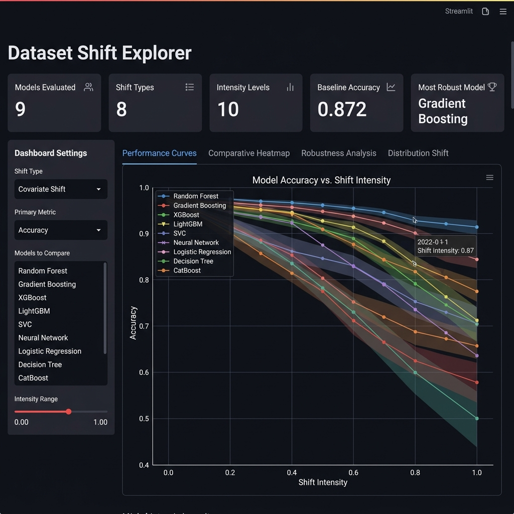
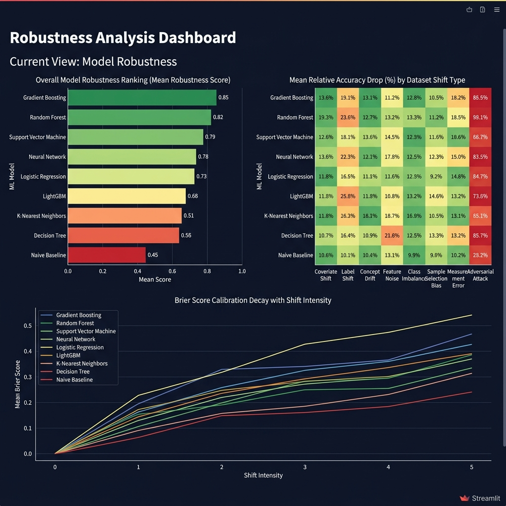

# Dataset Shift: Assessing Model Robustness to Environmental Change

Course   : DSCI 441 Machine Learning
Milestone: 2
Dataset  : UCI Adult Income (OpenML ID 1590)

## Overview

Real machine learning systems often see data at deployment time that does not look like the training data. Sensors drift, populations change, labeling rules get updated, and pipelines silently break. This problem is usually called dataset shift, and it is one of the easiest ways for a model to fail without anyone noticing.

In this project I built a reproducible experiment pipeline that studies how nine classical machine learning models behave under eight different families of shift, applied at ten intensity levels each. For every (model, shift, intensity) combination the pipeline computes a long list of metrics, bootstraps 95 percent confidence intervals, runs distribution divergence tests, and produces a single Robustness Score so the models can actually be ranked. All of this then shows up inside an interactive Streamlit dashboard.

## Streamlit Dashboard

The dashboard is organised into four analysis tabs.

Tab 1. Performance Curves. Multi model accuracy, F1 and ROC AUC trajectories as the shift intensity goes from 0 to 1. Shaded bands are 95 percent bootstrap confidence intervals.



Tab 3. Robustness Analysis. Horizontal model ranking by composite Robustness Score, a global relative drop heatmap across all shift types, and Brier Score calibration decay curves.



Launch the dashboard with

```
streamlit run app.py
```

## Project Structure

```
dataset-shift-project/
├── main.py                       Entry point for the full experiment pipeline
├── app.py                        Streamlit interactive dashboard
├── requirements.txt              Python package dependencies
│
├── src/
│   ├── data_loader.py            UCI Adult Income loading and preprocessing
│   ├── models.py                 Model registry (9 estimators including XGBoost)
│   ├── shift_simulators.py       Eight shift simulation algorithms
│   ├── evaluation.py             Metrics, bootstrapping, robustness scoring
│   ├── visualizations.py         Plot functions used by the dashboard
│   ├── run_experiments.py        Experiment orchestration loop
│   ├── stats_utils.py            KS test, CLT, LLN, hypothesis testing helpers
│   └── utils.py                  PSI, logging, seed management, path helpers
│
├── data/
│   └── readme_data.txt           How to obtain the data (auto download or manual)
├── results/
│   └── experiment_results.csv    Tidy result table (auto generated)
├── figures/                      Auto saved PNG plots (auto generated)
├── outputs/                      Supplementary artifacts (auto generated)
└── docs/screenshots/             Dashboard screenshots used in this README
```

## Shift Taxonomy

Eight shift families share the same simple contract. Every function takes an `intensity` argument in [0.0, 1.0], and `intensity = 0.0` always returns the unmodified baseline data.

| ID | Family | Mechanism | What changes |
|----|--------|-----------|---------------|
| A  | Covariate Shift   | Gaussian noise plus multiplicative drift on continuous features | P(X) |
| A2 | Scaling Drift     | Log normal rescaling per feature (sensor calibration drift) | P(X) |
| B  | Label Shift       | Progressive minority class undersampling | P(Y) |
| C  | Concept Drift     | Feature corruption plus label flipping on top features | P(Y given X) |
| D  | Gaussian Noise    | Pure additive i.i.d. Gaussian noise | P(X) |
| E  | MCAR Missingness  | Uniformly random cell masking | P(X) |
| E2 | MAR Missingness   | Masking conditioned on an observed feature | P(X) |
| F  | Feature Removal   | Zeroing of top informative columns (pipeline failure) | P(X) |

## Models

Nine estimators are trained once on the clean training set and then evaluated repeatedly under all shift conditions.

| Model | Type |
|-------|------|
| Naive Baseline (DummyClassifier) | Mode predictor, performance floor |
| Naive Bayes | Generative, Gaussian likelihood |
| Logistic Regression | Linear discriminative |
| SVM (RBF) | Kernel method, non linear |
| Decision Tree | Single deep tree, overfit prone reference |
| Random Forest | Bagging ensemble |
| Gradient Boosting | Sequential boosting ensemble |
| AdaBoost | Adaptive boosting |
| XGBoost | Regularized gradient boosting (when installed) |

## Evaluation Framework

Every (model, shift type, intensity) combination is evaluated with the same bundle of statistics.

Point estimates

* Accuracy, Precision, Recall and F1 (weighted average)
* ROC AUC (when there is at least one positive sample)
* Brier Score (proper probability calibration metric)
* Confusion matrix counts: TP, TN, FP, FN

Uncertainty quantification

* 200 iteration bootstrap resampling with replacement
* 95 percent confidence intervals for all six metrics

Distribution divergence

* Kolmogorov Smirnov statistic (average and maximum across features)
* Population Stability Index (PSI), with the standard thresholds: below 0.10 means no action, between 0.10 and 0.20 means monitor, above 0.20 means investigate

Robustness scoring

Two complementary indices are computed per (model, shift) pair.

```
Robustness Score  = (shifted_accuracy / baseline_accuracy) * (1 - KS_statistic)
Relative Drop (%) = (baseline_accuracy - shifted_accuracy) / baseline_accuracy * 100
```

Statistical significance

A one sided Welch t test compares the bootstrapped accuracy distribution of each (model, shift) combination against the same model's clean baseline. Rows where `Significant_Shift = True` confirm that the observed degradation is bigger than what sampling noise alone could explain.

## Statistical Foundations

This project leans on four standard statistical ideas that were already introduced in Milestone 1.

Central Limit Theorem. The 200 sample bootstrap distributions of Accuracy, F1 and ROC AUC look approximately normal, so percentile based confidence intervals are valid even though the underlying metric distribution may not be normal.

Law of Large Numbers. As the experiment iterates, the sample mean of any metric converges to its true expected value under each shift regime, so the simulation noise averages out.

Hypothesis Testing. The one sided Welch t test, with H0 saying there is no difference and Ha saying baseline accuracy is greater than shifted accuracy, gives a formal way to declare when degradation is real and not noise.

Kolmogorov Smirnov Test. The two sample KS test measures the maximum distance between the empirical CDFs of the baseline and the shifted feature distributions. It is non parametric and distribution free.

## Reproduction

Step 1. Install dependencies.

```
pip install -r requirements.txt
```

Step 2. Run the full experiment pipeline.

```
python main.py
```

This downloads the UCI Adult Income dataset, trains all nine models on the clean data, sweeps the eight shift families across ten intensity levels, computes all metrics with 200 bootstrap iterations, saves `results/experiment_results.csv`, and writes around 40 figures into `figures/`. On a normal laptop the whole thing takes about 15 to 25 minutes, mostly spent fitting SVM and Gradient Boosting on roughly 33,000 samples.

Step 3. Explore the results interactively.

```
streamlit run app.py
```

The dashboard reads the pre computed results CSV and does not retrain anything.

## Key Findings (Milestone 2)

The experiment suite produces a tidy table with around 25 columns and over 700 rows covering all (model, shift, intensity) combinations. Some early observations from the saved CSV.

* Ensemble methods (Gradient Boosting, Random Forest, XGBoost) consistently get the highest Robustness Scores across most shift types.
* Logistic Regression is surprisingly robust under Covariate Shift but collapses quickly under Concept Drift, because a linear decision boundary cannot adapt when P(Y given X) changes.
* Feature Removal is the most damaging shift type for tree based models that lean on a small set of top features.
* Naive Bayes is the worst calibrated model under shift. Its Brier Score climbs steeply even at low intensities.
* MCAR Missingness above intensity 0.5 pulls every model toward the Naive Baseline performance, which suggests the imputation quality (mean fill in standardized space) is the binding constraint.

## Milestone 2 vs Milestone 1

| Component | Milestone 1 | Milestone 2 |
|-----------|--------------|--------------|
| Shift families | 3 (Covariate, Prior, Concept adjacent) | 8 (full taxonomy) |
| Intensity levels | 5 | 10 |
| Models | 8 (no XGBoost) | 9 (XGBoost optional) |
| Metrics per evaluation | 4 | 11 plus confusion matrix |
| Bootstrap iterations | 100 | 200 |
| PSI computation | No | Yes |
| Robustness Score | No | Yes |
| Relative drop | No | Yes |
| Auto saved figures | No | Yes (around 40 PNG files) |
| Dashboard tabs | 1 | 4 |
| Evaluation state | Module level globals | Explicit EvaluationContext class |
| Logging | print() calls | Structured logging.Logger |

This project is the Milestone 2 deliverable for DSCI 441 Machine Learning.
